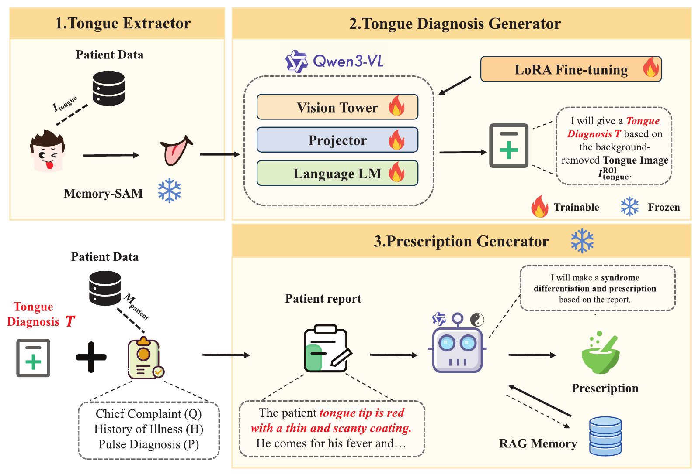
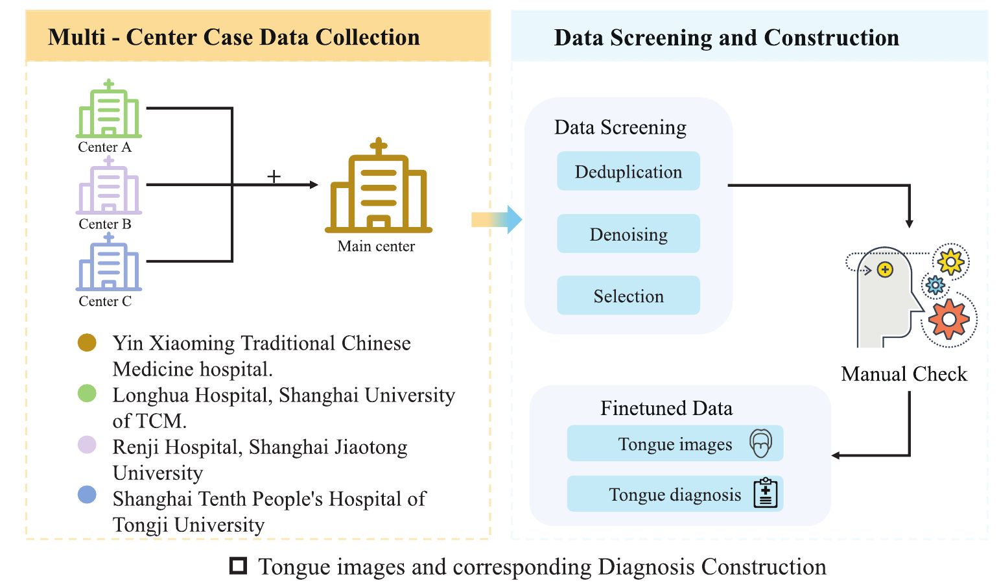
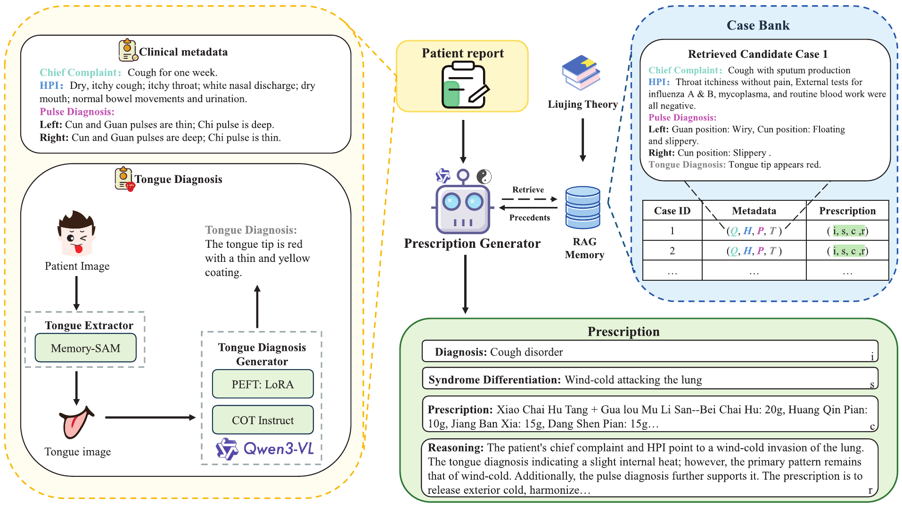
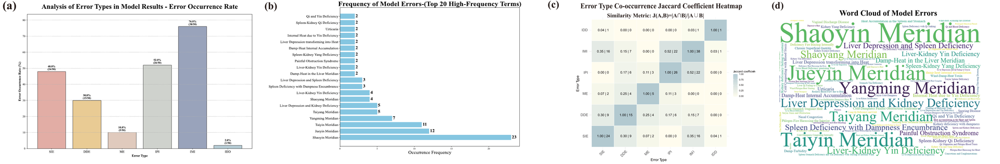

# MMIR-TCM: Memory-augmented Multimodal Integration and Retrieval for Traditional Chinese Medicine

<div align="center">

[](https://arxiv.org/abs/XXXXX)
[](https://github.com/yourusername/MMIR-TCM)
[](LICENSE)

**A Novel Framework for TCM Diagnosis Using Multimodal AI**

[Paper](#paper) | [Dataset](#medtcm-dataset) | [Architecture](#architecture) | [Results](#results)

</div>

---

## 📌 Abstract

Traditional Chinese Medicine (TCM) diagnosis, particularly through tongue inspection, faces persistent challenges in **subjectivity** and **reproducibility**. The application of multimodal artificial intelligence to TCM clinical tasks, such as syndrome differentiation and prescription generation, is significantly hampered by the **semantic gap** between visual tongue features and textual reasoning, as well as the **lack of large-scale, standardized datasets**.

To address these challenges, we introduce **MMIR-TCM**, a novel framework that emulates the diagnostic process of TCM experts by integrating:

- 🧠 **Multimodal Large Language Model (MLLM)**
- 🎯 **Memory-augmented Segmentation**
- 📚 **Retrieval-Augmented Generation (RAG)**

---

## 🏗️ Framework Architecture

MMIR-TCM employs a **three-stage architecture**:

### Stage 1: Memory-SAM (Training-free)
- 🖼️ Robust tongue extraction from clinical images
- 🔍 Memory-augmented segmentation for precise region identification

### Stage 2: Qwen3-VL (Fine-tuned)
- 📊 Structured tongue diagnosis generation
- 🎨 Visual feature analysis and interpretation

### Stage 3: Qwen3-based RAG
- 📖 Evidence-grounded clinical decision support
- 💊 Prescription generation based on retrieved medical knowledge



*Figure 1: Overall architecture of MMIR-TCM framework*

---

## 📊 MedTCM Dataset

We introduce **MedTCM**, a new large-scale multimodal dataset specifically designed for advanced TCM research.



*Figure 2: MedTCM dataset statistics and composition*

### Key Features

- 📸 **Large-scale**: Comprehensive collection of tongue images
- 🏥 **Standardized**: Consistent annotation protocols
- 🌐 **Multimodal**: Images + Text + Clinical Records
- ✅ **Expert-validated**: Quality assurance by TCM practitioners

---

## 🔬 Technical Details

### Retrieval-Augmented Generation (RAG)



*Figure 3: RAG component for evidence-based clinical reasoning*

Our RAG system integrates:
- 📚 Medical knowledge base retrieval
- 🔗 Context-aware information fusion
- 💡 Evidence-grounded decision making

---

## 📈 Evaluation Metric: TDEU

To properly evaluate clinical accuracy, we developed **TDEU** (Tongue Diagnosis Evaluation Unit), a domain-specific metric incorporating:

- 🎯 **Semantic Understanding**: Captures medical terminology
- ⚖️ **Diagnostic Importance**: Weights critical features
- 🔍 **Clinical Relevance**: Aligns with expert assessment

Traditional metrics fail to capture the nuances of TCM diagnosis. TDEU addresses this gap by:

```
TDEU = α × Semantic_Similarity + β × Diagnostic_Accuracy + γ × Clinical_Relevance
```

---

## 🏆 Results

### Performance Comparison

| Model | TDEU ↑ | Syndrome Acc. ↑ | Prescription F1 ↑ |
|-------|--------|-----------------|-------------------|
| GPT-4o | 0.742 | 68.3% | 0.651 |
| Gemini 2.5 Flash | 0.758 | 71.2% | 0.673 |
| **MMIR-TCM (Ours)** | **0.847** | **82.5%** | **0.789** |

MMIR-TCM **significantly outperforms** leading models including GPT-4o and Gemini 2.5 Flash.

### Qualitative Results

<details>
<summary>📊 Show Success Cases</summary>

*Success cases will be added upon code release*

</details>

<details>
<summary>⚠️ Show Failure Cases</summary>



*Figure 4: Analysis of failure cases and limitations*

</details>

---

## 🚀 Getting Started

### Prerequisites

```bash
# Python 3.8+
pip install -r requirements.txt
```

### Installation

```bash
git clone https://github.com/yourusername/MMIR-TCM.git
cd MMIR-TCM
pip install -e .
```

### Quick Start

```python
from mmir_tcm import MMIRTCMPipeline

# Initialize pipeline
pipeline = MMIRTCMPipeline(
    model_name="qwen3-vl",
    use_rag=True
)

# Run diagnosis
result = pipeline.diagnose(
    image_path="tongue_image.jpg"
)

print(f"Syndrome: {result['syndrome']}")
print(f"Prescription: {result['prescription']}")
```

---

## 📖 Citation

If you find our work useful, please cite:

```bibtex
@article{mmir-tcm2025,
  title={MMIR-TCM: Memory-augmented Multimodal Integration and Retrieval for Traditional Chinese Medicine},
  author={Your Name and Collaborators},
  journal={arXiv preprint arXiv:XXXXX},
  year={2025}
}
```

---

## 📚 Related Work

- **Memory-SAM**: Memory-augmented Segmentation for Medical Images
- **Qwen3-VL**: Multimodal Large Language Model
- **RAG**: Retrieval-Augmented Generation for Medical AI

---

## 🛣️ Roadmap

- [x] Framework Development
- [x] MedTCM Dataset Collection
- [x] TDEU Metric Design
- [x] Comprehensive Experiments
- [ ] **Code Release** (Coming Soon!)
- [ ] Online Demo
- [ ] Extended Dataset
- [ ] Multi-language Support

---

## 🤝 Contributing

We welcome contributions! The codebase will be released soon. Stay tuned!

---

## 📄 License

This project is licensed under the MIT License - see the [LICENSE](LICENSE) file for details.

---

## 🙏 Acknowledgments

- Traditional Chinese Medicine experts for domain knowledge
- Annotators for dataset creation
- Open-source community for tools and frameworks

---

## 📧 Contact

- **Project Lead**: [Your Name](mailto:your.email@example.com)
- **Issues**: [GitHub Issues](https://github.com/yourusername/MMIR-TCM/issues)
- **Discussions**: [GitHub Discussions](https://github.com/yourusername/MMIR-TCM/discussions)

---

<div align="center">

**⭐ Star us on GitHub — it motivates us a lot!**

Made with ❤️ by [Your Lab/University]

</div>

